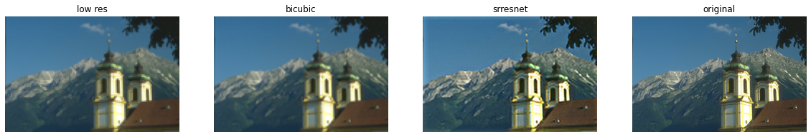

# torch_isr
PyTorch models for Image Super Resolution

## Usage
### Running
```
usage: super_resolve.py [-h] --model MODEL --checkpoint CHECKPOINT
                        [--output_filename OUTPUT_FILENAME]
                        input_image

Image Super Resolution

positional arguments:
  input_image           input image

required arguments:
  --model MODEL         type of ISR model to use
  --checkpoint CHECKPOINT
                        saved model checkpoint to use

optional arguments:
  -h, --help            show this help message and exit
  --output_filename OUTPUT_FILENAME
                        output image name (default: out.png)

```

Example usage:

```
python super_resolve.py --model SrResNet --checkpoint trained_models/srresnet4x.ckpt input.jpg
```

<p>
  
</p>
